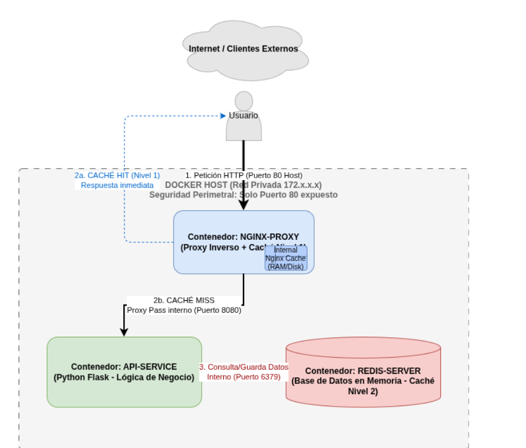

# Práctica 10: Infraestructura de Microservicios, Caché y Gestión de Versiones

## 1. Descripción
Este proyecto consiste en el despliegue de una arquitectura de microservicios para la empresa "Cloud-Fast" 
El objetivo es implementar un entorno seguro y eficiente utilizando contenedores Docker, con un enfoque en tres pilares: Seguridad Perimetral, Alto Rendimiento y Buenas Prácticas DevOps.

## 2. Diagrama de Arquitectura
El sistema utiliza una red privada interna (172.x.x.x) donde solo el Proxy Nginx es accesible desde el exterior.




## 3. Instrucciones de Despliegue
Para clonar y levantar el entorno completo, ejecute los siguientes comandos en su terminal:

```bash
# Clonar el repositorio
git clone (https://github.com/joseluisinformatica24-debug/jjimban-seguridad.git)

# Entrar en la carpeta
cd nombre-repositorio

# Levantar la infraestructura
docker-compose up -d --build
```
